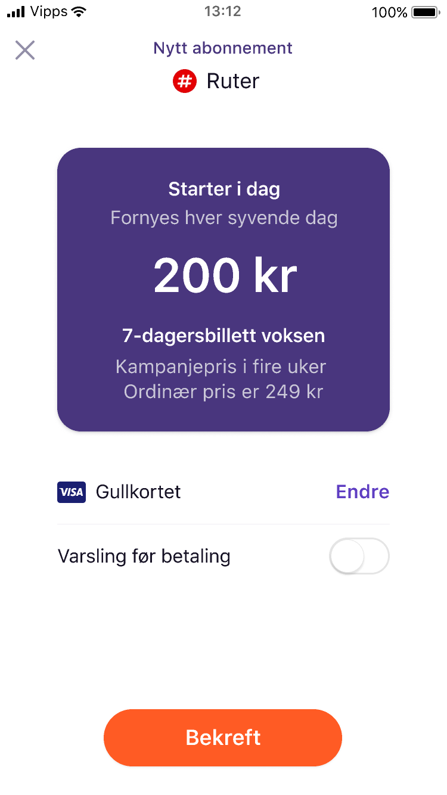

# Vipps PSP Recurring API

Vipps Recurring API delivers recurring payment functionality for a merchant to create a payment agreement with a customer for fixed interval payments. When the agreement is accepted by the end user the merchant can send charges that will be automatically processed on the due date.

**Terminology**

| Term |  Description                                    |
|:-----|:----------------------------------------------- |
| Agreement         | An payment subscription with a set of parameters that a customer agrees to  |
| Charge         | A single payment within an agreement |
| Idempotency | The property of endpoints to be called multiple times without changing the result beyond the initial application. |

## How to perform recurring payments

1. Draft an agreement to be approved with [`POST:/draftAgreement`](https://). In the response an `agreementResource` is created with an `agreementId`

2. The approved agreement is retrieved from [`GET:/agreement/{agreementId}`](https://) with `"status":"active"` when customer approves the agreement

3. Create charges on the agreement with [`POST:/charge/{agreementId}`](https://)

5. Manage charges and agreements with [`DELETE:/charge/{agreementId}/{chargeId}`](https://), [`POST:/charge/{agreementId}/{chargeId}/refund`](https://) & [`POST:/agreement/{agreementId}`](https://)

### Step 1: Draft an agreement
The following code illustrates how to create an agreement:

`POST:/draftAgreement`
```
{
  "currency": "NOK",
  "customerPhoneNumber":"90000000",
  "interval": "WEEK",
  "intervalCount": 2,
  "isApp": false,
  "merchantRedirectUrl": "https://vipps.no",
  "merchantAgreementUrl": "https://vipps.io/terms",
  "price": 135,
  "productDescription": "Access to all games of English top football",
  "productName": "Premier League Package"
}
```

Agreements can be initiated with initial charges and/or one-time amounts

| # | Agreement      | Description                                                                          |
|:--|:-----------|:-------------------------------------------------------------------------------------|
| 1 | `Agreement starting now`  | Agreement with an `initialcharge` will only be `active` if the initial charge is processed successfully |
| 2 | `Agreement starting in future`  | Agreement without an `initialcharge` can be approved but no payment will happen until the first charge is provided |
| 3 | `Agreement with additional one-time amount`  | Agreement with an `oneOffCharge` will make an separate payment request together with the agreement approval to pay an additional amount. Can be used with or without an `initialcharge` |

**Initial charge**
Initial charge will be performed if the `initialcharge` is provided when creating an agreement. The `amount` has to correspond to the `price` of the agreement.
```
"initialCharge": {
  "amount": 135,
  "currency": "NOK",
  "description": "Payment for September"
},
```

**One-time amount**
An agreement can be created with an additional payment amount with the `oneOffCharge`
```
"oneOffCharge": {
  "amount": 330,
  "currency": "NOK",
  "description": "Payment for TV"
},
```

### Step 2: Retrieve the approved agreement
The agreement will be possible to accept for 5 minutes before it expires. When customer approves the agreement status will change to `active`

`GET:/agreement/{agreementId}`
```
{
  "currency": "NOK",
  "id": "agr_5kSeqzFAMkfBbc",
  "interval": "WEEK",
  "intervalCount": 2,
  "price": 135,
  "merchantAgreementUrl": "https://vipps.io/terms",
  "productDescription": "Access to all games of English top football",
  "productName": "Premier League Package",
  "startDate": "2018-08-22",
  "status": "ACTIVE",
}
```

### Step 3: Create a charge
Create a charge for a given agreement. `dueDate` will define for which date the charge will be performed. `hasPriceChanged` must be `true` if the amount for the charge is different from the agreement price.

`POST: /charge/{agreementId}`
```
{
  "amount": 234,
  "currency": "NOK",
  "description": "Payment for October",
  "dueDate": "2030-10-28",
  "hasPriceChanged": true,
  "pspPaymentDetails": {
    "pspTransactionId": "7686f778889876797711",
    "makePaymentUrl": "https://psp.vipps.io",
    "makePaymentToken": "ynuiu"
  }
}
```

### Step 4: Manage charges and agreements
Manage charges and agreement

* Cancel charges with `DELETE:/charge/{agreementId}/{chargeId}`
* Refund performed charges with `POST:/charge/{agreementId}/{chargeId}/refund`
* Update agreements with `POST:/agreement/{agreementId}` in case there are any changes

#### Agreement states
| # | State      | Description                                                                          |
|:--|:-----------|:-------------------------------------------------------------------------------------|
| 1 | `pending`  | Agreement has been created, but not approved by the user in the app yet |
| 2 | `active` | The Agreement has been confirmed by the end user in the app and can receive charges |
| 3 | `stopped`  | Agreement has been stopped by the merchant most, typically when the end user wants to cancel the payment agreement |

#### Charge states
| # | State      | Description                                                                          |
|:--|:-----------|:-------------------------------------------------------------------------------------|
| 1 | `pending`  | Charge has been created. |
| 2 | `due` | The charge will be drawn in 8 days, and can now be viewed by the user in the app                                      |
| 3 | `charged`  | Charge has been completed
| 4 | `failed`  | Charge has failed for some reason. I.E Expired card, insufficient funds, etc.
| 5 | `refunded` | Charge successfully refunded. Timeframe for issuing a refund for a payment is 365 days from the date payment has been captured
| 6 | `partially_refunded`| Charge successfully refunded, used if the refund is a partial ammount of the captured amount.

## Campaigns
A campaign in recurring is a period where the price is lower than usual, and this is communicated to the customer with the original price shown for comparison.

As seen in the following
[Campaign image](images/CampaignExample.PNG)


In order to start a campaign the campaign field has to be added either to the agreement [`POST:/draftAgreement`](https://) for a campaign in the start of an agreement or in a charge [`POST:/charge/{agreementId}`](https://) for an ongoing agreement.
```
"campaign": {
	"campaignChargesRemaining": 4,
	"originalPrice": 234
}
```

| Field         | Description                                 |
| ------------------- | ------------------------------------------- |
| `campaignChargesRemaining`            | Used to calculate the time remaining time text |
| `originalPrice`       | The price that will be shown for comparison   |

# Questions?

We're always happy to help with code or other questions you might have! Please create an [issues](https://github.com/vippsas/vipps-recurring-api/issues), a [pull requests](https://github.com/vippsas/vipps-recurring-api/pulls), or contact us at `integration@vipps.no`.
