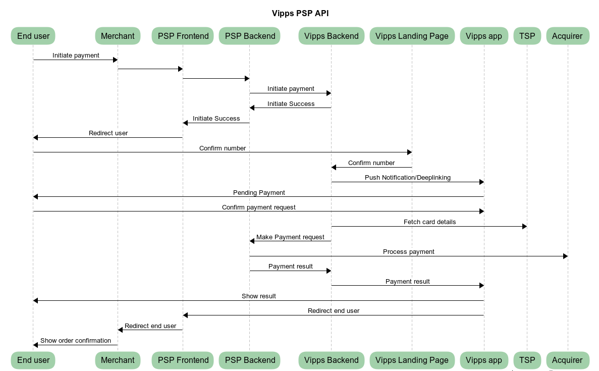
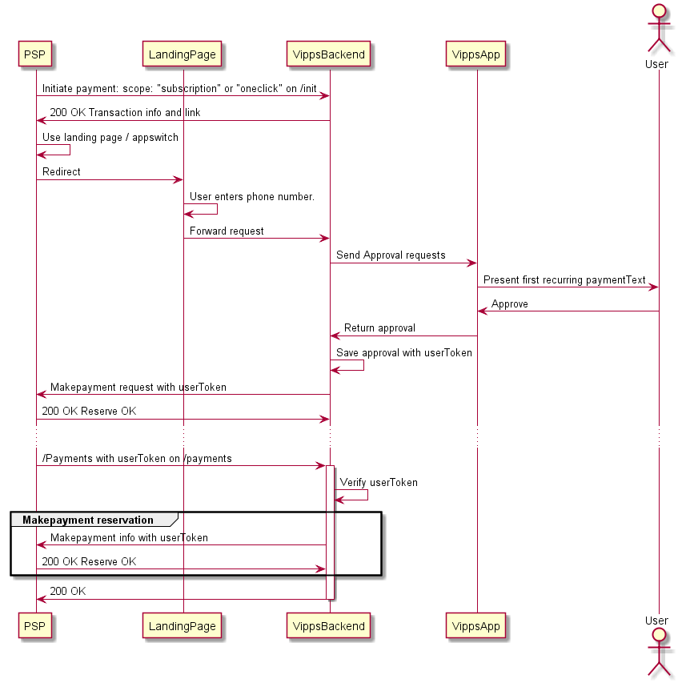

# Vipps PSP API version 2

[Vipps på Nett](https://www.vipps.no/bedrift/vipps-pa-nett)
(eCommerce) via PSP offers functionality for payments on
websites and apps (P2M). Vipps på Nett offers merchants functionality to
provide a solution where the end user only enters her Norwegian mobile number
to retrieve a payment request in the Vipps app.

In the Vipps app, the user selects a payment source to complete the payment
request. Vipps initiates the payment transaction on the selected source and
provide feedback to the PSP of the payment card selected.

The PSP processes the payment transaction and provides feedback to merchant
and Vipps of the payment transaction success or failure.

API version: 2.0

Document version 1.0.3

API details: [Swagger UI](https://vippsas.github.io/vipps-psp-api/#/),
[swagger.yaml](https://raw.githubusercontent.com/vippsas/vipps-psp-api/master/docs/swagger.yaml),
[swagger.json](https://raw.githubusercontent.com/vippsas/vipps-psp-api/master/docs/swagger.json).

## Differences from PSP API version 1

* Added support for redirection of user after payment completion in the Vipps app
* Added support for providing the `makePayment` URL in the initiate payment call
* Improved authorization of the `makePayment` call by adding the authorization header value
* Improved and more consistent parameter names in the API

## PSP payment sequence



### PSP implementation checklist

See the [Vipps PSP API Checklist](vipps-psp-api-checklist.md) for details.

### Initiate payment

A payment request is initiated by the PSP to the Vipps API after the user has
request to pay with Vipps. Vipps then returns a link to
the Vipps landing page where the user can confirm the mobile number.
Once the user has confirmed the number, the payment can be considered initiated.

### Payment confirmation

After payment initiation, Vipps sends a push notification or redirects the user to
the Vipps app.  The user verifies the Vipps profile by logging in to the Vipps
app. The app then displays the amount, and the user can confirm the payment.


### MakePayment

Once the user has confirmed the payment, Vipps shares the encrypted card
details with the PSP trough the makePaymentUrl endpoint. The PSP processes the payment
through the acquirer and responds to the makePayment-call with the payment
request status. The user receives confirmation in Vipps app. Vipps redirects
the user to the redirectUrl provided during payment initiation.

## Example request

```json
Authorization: makePaymentToken
{
  "pspTransactionId": "7686f7788898767977",
  "merchantSerialNumber": "123456",
  "cardData": "f0a29801b4#d4ff30e221fa2980ff30e2",
  "confirmed": "YES/TIMEOUT/CANCEL"
}
```

## Example response

```json
{
  "errorMessage": {
    "errorId": 82,
    "errorText": "Refused by Issuer"
  },
  "paymentInfo": {
    "pspTransactionId": "7686f7788898767977",
    "status": "FAIL"
  }
}
```
### Status Updates

To provide a consistent user experience it is important that Vipps is notified by changes to the payment status when it is captured, cancelled or refunded. Vipps also provides an endpoint to check the payment status.

## Idempotency

All API requests in Vipps eCommerce can be retried without any side effects
by providing idempotent key in a header of  the request. For example, in
case the request fails because of network error it can safely be retried
with the same idempotent key. Idempotent key is generated by merchant.

```
Request-Id: slvnwdcweofjwefweklfwelf
```

# Authentication

Every API call is authenticated and authorized based on the application
Authorization token (JWT) and APIM subscription key
(`Ocp-Apim-Subscription-Key`). Following headers are required to be there in every API request
to successfully authenticate every API call.

| Header Name | Header Value | Description |
| :-------------------------- | :--------------------------- | :--------------------------------------------- |
| Authorization | Bearer 'jwt_access_token'' | type: Authorization token. Value: Access token is obtained from accessToken/get |
| Ocp-Apim-Subscription-Key | Base 64 encoded string | Subscription key for the product.<br>Can be found in Vipps developer portal |


## HTTP responses

This API returns the following HTTP statuses in the responses:

| HTTP status         | Description                                 |
| ------------------- | ------------------------------------------- |
| `200 OK`            | Request successful                          |
| `400 Bad Request`   | Invalid request, see the error for details  |
| `401 Unauthorized`  | Invalid credentials                         |
| `403 Forbidden`     | Authentication ok, but credentials lacks authorization  |
| `404 Not Found`     | The resource was not found  |
| `500 Server Error`  | An internal Vipps problem.                  |


# Recurring PSP payments

The PSP API supports recurring payments out of the box. This enables the PSP to perform recurring payments through Vipps, while retaining full transactional control. This has been built as an extension to the existing PSPv2 API, and no existing integrations will be affected, other than the possibility to initialize and preform recurring payments.

## Subscription and oneclick scopes

As of now, there are two possible ways to perform a recurring payment - *subscription* and *oneclick*. These are referred to as the *scope* of the recurring agreement. Only one *scope* can be used at a time, and it's not possible to change the scope of an agreement.

*Subscription* based payments are created as a consent to an agreement that allows withdrawal of money on intervals. This implies that the user won't have to accept the payment on each occasion, only the first occasion when consenting to the agreement. An example of this could be a subscription to a music streaming service paid monthly. 

*Oneclick* payments are created as agreements where the user will be prompted on each payment. An example of a oneclick payment might be a ticketing service where the user will get prompted to buy a new ticket when the old one expires. Instead of switching to the app to accept the payment, the user already has a oneclick recurring agreement with Vipps as the payment source. 

## Initialize a recurring payment

Initializing a recurring payment works in the same way as a non-recurring payment, but with the inclusion of a *scope* and *agreementURL* in the init call.

The *scope* can at the time be set to either *subscription* or *oneclick*. The *agreementURL* should be a link to where the user can click to administer the agreement.

To start the initialization, create a standard /init call with the addition of the required fields. If you want to initialize a recurring *subscription*, the init request body could look like this.

```json
{
  "pspRedirectUrl": "yourRedirectUrl",
  "amount": 1337,
  "makePaymentToken": "tokenGoesHere",
  "makePaymentUrl": "yourCallbackEndpointUrl",
  "currency": "NOK",
  "merchantOrderId": "123123123",
  "isApp": false,
  "pspTransactionId": "{{psptransactionid}}",
  "paymentText": "Order id: 213213",
  "scope": "subscription",
  "agreementURL": "linkToTheAgreement"
}
```

In the same way as a normal, non-recurring PSPv2 payment, the PSP will receive a *makePayment* callback. In the body of this callback, you will now also find a *userToken*.

## The userToken

The user token is a token generated when the user has given a consent. This token is provided to the PSP in the makePayment callback when initializing or preforming a recurring payment.

A *userToken* contains the *scope* of the consent, in the claim named *scope*. The token also includes various useful information

```
{
  "sub" // agreement_id
  "aud" // audience (usually something like "https://vipps.no")
  "iat" // issue_day_time
  "scope"
}
```


## Do the next recurring payment

After initialisation, the next payment can be made by passing your *userToken* to the */payments* endpoint as a header with the name *userToken*.

```json
HEADER: "
        Authorization: asd123
        Ocp-Apim-Subscription-Key: asdf234
        PSP-ID: sdf421
        Meerchant-Serial-Number: dsdf322
        UserToken: 123abc
        "
{
  "pspTransactionId": "123",
  "merchantOrderId": "123ABCD",
  "amount": 100,
  "currency": "NOK",
  "makePaymentUrl": "http://yourPaymentUrl",
  "makePaymentToken": "token123",
  "paymentText": "Description of payment"
}
```

## Error responses
Error responses has this format:

```json
[
    {
        "errorCode": "99",
        "errorMessage": "OrderId already exists"
    }
]
```
The error message might change, and you should not base any application logic on it.

These are the possible error codes and messages:
| errorCode        | errorMessage                                                   | comment                                             |
| ---------------- | -------------------------------------------------------------- | --------------------------------------------------- |
| `21`             | Merchant not available or active                               |													  |
| `22`             | OrderId must be unique.                                        |													  |
| `31`             | User is not registered with VIPPS                              |													  |
| `32`             | User is not registered with VIPPS                              |													  |
| `42`             | Invalid payment model type                                     |													  |
| `43`             | PSP Id not enrolled in Vipps.                                  |													  |
| `44`             | TransactionId already exist                                    |													  |
| `45`             | Payment execution failed                                       |													  |
| `101`            | User Token is invalid                                          |													  |
| `111`            | Agreement not found                                            |													  |
| `1501`           | Vipps users below 15 can not pay to companies.                 |													  |
| `1502`           | Vipps users below 15 years can only pay to friends and family. |													  |
| `51`             | Various messages                                               | For Invalid requests								  |
| `99`             | Various messages                                               | For unhandled exceptions							  |
| `makePaymentUrl` | Invalid makePaymentUrl                                         | Validation failed for the field given in errorcode. |

## Recurring payment flow


# Questions?

We're always happy to help with code or other questions you might have!
Please create an [issue](https://github.com/vippsas/vipps-psp-api/issues),
a [pull request](https://github.com/vippsas/vipps-psp-api/pulls),
or [contact us](https://github.com/vippsas/vipps-developers/blob/master/contact.md).
